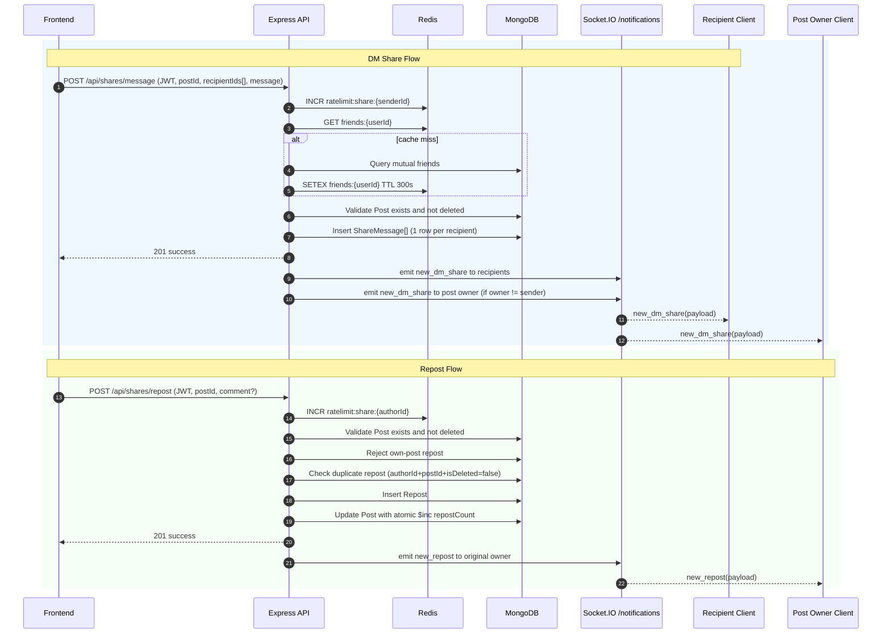

# FE Share Integration Guide

Tài liệu tích hợp Frontend cho module Share Post.

- DM Share: gửi post kèm tin nhắn đến 1 hoặc nhiều user.
- Repost: đăng lại post lên feed, có thể kèm comment (quote repost).

## 1. API Contract

### 1.1 POST `/api/shares/message`

**Auth**: Bắt buộc JWT Bearer token.

**Headers**

- `Authorization: Bearer <access_token>`
- `Content-Type: application/json`

**Request Body (typed)**

```ts
type SendDMShareRequest = {
  postId: string; // MongoId
  recipientIds: string[]; // 1..10 userIds
  message?: string; // max 2000 ký tự
};
```

**Success Response (typed)**

```ts
type SendDMShareSuccess = {
  success: true;
  message: string;
  data: {
    postId: string;
    recipientIds: string[];
    sentCount: number;
  };
  timestamp: string; // ISO
};
```

**Error Response (typed)**

```ts
type ApiError = {
  success: false;
  error: {
    code: string;
    message: string;
    details?: unknown;
  };
  timestamp: string;
};
```

---

### 1.2 POST `/api/shares/repost`

**Auth**: Bắt buộc JWT Bearer token.

**Headers**

- `Authorization: Bearer <access_token>`
- `Content-Type: application/json`

**Request Body (typed)**

```ts
type RepostRequest = {
  postId: string; // MongoId
  comment?: string; // max 2000 ký tự
};
```

**Success Response (typed)**

```ts
type RepostSuccess = {
  success: true;
  message: string;
  data: {
    repostId: string;
    postId: string;
    comment?: string;
    createdAt: string; // ISO
  };
  timestamp: string;
};
```

**Error Response (typed)**: dùng chung `ApiError`.

## 2. WebSocket Events

Namespace: `/notifications`

Client cần:

1. Kết nối socket vào namespace `/notifications`.
2. Emit `register` với `userId` sau khi connect/reconnect.

**Payload schema chuẩn cho cả 2 event**

```ts
type ShareNotificationPayload = {
  type: "dm_share" | "repost";
  shareId: string;
  postId: string;
  actor: {
    id: string;
    name?: string;
    avatar?: string;
  };
  recipientId: string;
  message?: string; // DM message hoặc comment quote repost
  createdAt: string; // ISO
};
```

### 2.1 `new_dm_share`

- Chiều: server -> client
- Emit khi:
  - recipient nhận DM share
  - chủ post gốc nhận notification khi post của họ bị DM share

**Ví dụ JSON**

```json
{
  "type": "dm_share",
  "shareId": "681d11111111111111111111",
  "postId": "681c11111111111111111111",
  "actor": {
    "id": "680a11111111111111111111",
    "name": "Nguyen Van A",
    "avatar": "https://cdn.example.com/avatar-a.jpg"
  },
  "recipientId": "680b11111111111111111111",
  "message": "Bai nay hay ne",
  "createdAt": "2026-05-09T08:05:00.000Z"
}
```

### 2.2 `new_repost`

- Chiều: server -> client
- Emit khi:
  - có user repost bài của chủ post gốc

**Ví dụ JSON**

```json
{
  "type": "repost",
  "shareId": "681e11111111111111111111",
  "postId": "681c11111111111111111111",
  "actor": {
    "id": "680f11111111111111111111",
    "name": "Tran B",
    "avatar": "https://cdn.example.com/avatar-b.jpg"
  },
  "recipientId": "680a11111111111111111111",
  "message": "Quan diem cua minh ve bai nay...",
  "createdAt": "2026-05-09T08:06:00.000Z"
}
```

## 3. Error Code Handling Table

| Error code | HTTP status | Message (tham khảo) | FE nên xử lý |
| --- | --- | --- | --- |
| `UNAUTHORIZED` | 401 | Chưa xác thực | Refresh token hoặc chuyển login |
| `DTO_VALIDATION_ERROR` | 400 | Payload không hợp lệ | Hiển thị lỗi form, không retry tự động |
| `POST_NOT_FOUND` | 404 | Bài viết không tồn tại hoặc đã bị xoá | Gỡ post khỏi UI, reload feed/detail |
| `RECIPIENTS_LIMIT_EXCEEDED` | 400 | Chỉ được gửi tối đa 10 người | Chặn chọn thêm recipient |
| `RECIPIENT_SELF_INVALID` | 400 | Không thể gửi cho chính mình | Loại user hiện tại khỏi picker |
| `RECIPIENT_NOT_FRIEND` | 400 | Chỉ có thể DM share cho bạn bè | Lọc recipient list theo friend-only |
| `SHARE_RATE_LIMIT_EXCEEDED` | 400 | Vượt 20 lần chia sẻ/phút | Cooldown UI, cho retry sau |
| `REPOST_OWN_POST_FORBIDDEN` | 400 | Không thể repost bài của chính mình | Disable nút repost ở own post |
| `REPOST_DUPLICATED` | 409 | Đã repost bài viết này rồi | Đổi CTA sang "Đã repost" |

## 4. Sequence Diagram



## 5. Edge Case Checklist cho FE

- Validate client-side trước API call:
  - `recipientIds.length` phải trong `[1..10]`
  - không cho chọn chính mình
  - `message/comment` không quá 2000 ký tự
- Chặn double submit:
  - disable nút gửi/repost khi request đang pending.
- Dedupe realtime event:
  - nếu user mở nhiều tab, dedupe theo `shareId`.
- Reconnect socket:
  - reconnect vào `/notifications`
  - emit lại `register` sau reconnect.
- Nếu nhận `REPOST_DUPLICATED`, cập nhật state local thành `isReposted = true`.
- Nếu nhận `POST_NOT_FOUND`, remove post khỏi state hiện tại và điều hướng an toàn.
- Với `SHARE_RATE_LIMIT_EXCEEDED`, hiển thị countdown/cooldown tránh spam retry.
- Không phụ thuộc recipient online/offline:
  - API success không đồng nghĩa recipient đang online để nhận WS ngay.
- Không dùng WS thay cho source of truth:
  - sau khi nhận event, vẫn nên sync dữ liệu chính từ API khi user mở detail.
